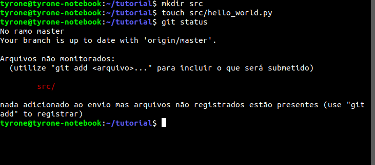
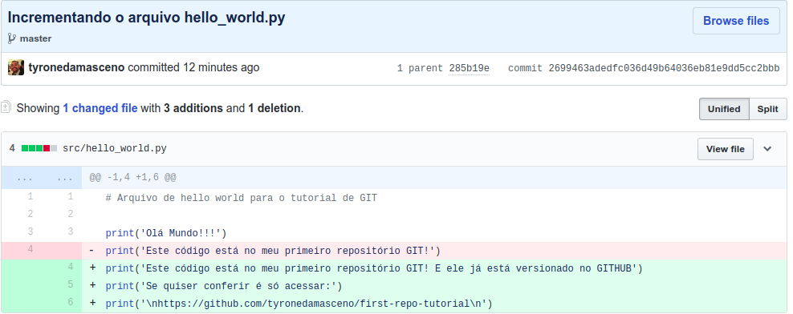

# Git Tutorial
Tutorial de primeiros passos com GIT e Github!

Olá! Eu sou Tyrone Damasceno, este rápido tutorial propõe explicar o que é e como se usa o a ferramenta de controle de versão GIT, e sua principal (*minha opinião*) plataforma, o Github.

A esta altura, espero que você já tenha visto a introdução de conceitos nos slides, mas caso contrário é só acessar os [slides online](https://slides.com/tyronedamasceno/deck) ou fazer o download [aqui](slides/slides.pdf)!

## Vamos lá, mão na massa!

Aqui nós vamos usar um ambiente Unix like, porém o GIT também funciona em outras plataformas.

Se seu computador é Ubuntu, ou algum de seus derivados, abra um terminal com o comando:
`CTRL + ALT + T`

Agora com um terminal aberto, crie uma nova pasta e navegue para dentro dela com os comandos:

```
$ mkdir tutorial
$ cd tutorial
```

Certo, agora você já criou uma pasta/diretório, precisamos transformar ela num repositório git, como fazer isso?

`$ git init`

Para conferir o que foi criado , digite o comando:

`$ ls -a`


Depois de criar o repositório git, é preciso configurar seu usuário e senha localmente. Fazemos isso com os comandos:

```
$ git config --global user.name "Tyrone Damasceno"
$ git config --global user.email "tyronedamasceno@gmail.com"
```


## Muito bem! Você acabou de inicializar seu primeiro repositório GIT!

Mas, e agora? O que fazer?

Como nós já sabemos, o git é um sistema de controle de versão, ou seja, ele monitora os seus arquivos e cria um histórico das alterações sem ser necessário criar os clássicos arquivos com `v1, v2, v2_final, v2_final_final, v3_agora_vai`, etc!

Então pra isso, vamos criar um arquivo na nossa pasta, para que ele possa ser controlado (aqui eu usarei Python e Markdown como exemplo, mas isso serve pra **QUALQUER TIPO DE ARQUIVO DE TEXTO**).

*Ok, eu sei que dá pra colocar arquivos binários (que não são texto, como imagens, pdf, executáveis, etc), mas não é o ideal, por que nós (humanos) geralmente não conseguimos distinguir alterações em bits, além de deixar o seu repositório "pesado"*

Voltando... Uma boa prática é criar um arquivo chamado `README.md` na raiz do seu repositório (tipo esse que você tá lendo), contendo informações importantes sobre o que vai ser criado, configurações e instruções de uso, etc.

Então, vamos criar! Aqui eu usarei o Visual Studio Code para editar meus arquivos, mas sinta-se a vontade para trabalhar com o editor de texto que você preferir! Para abrir o VS Code já no seu repositório, basta navegar no terminal até a raiz do projeto e digitar o comando:
`$ code .`
O argumento . significa "a pasta atual".

No README eu escreverei uma breve descrição do repositório utilizando linguagem markdown!


## Eita, eu já estou versionando?

Calma, falta muito pouco, nós criamos o arquivo, agora vamos dizer ao GIT pra ficar tomando conta dele.

Primeiro, vamos ver o comando de git MAIS USADO de todos! Digite no seu terminal:

`$ git status`

Você deve ver algo assim:


Olha o que ele está te dizendo: O arquivo `README.md` não está monitorado. Antes de fazer o nosso commit (calma, ainda vou explicar o que é), precisamos adicionar ele a uma chamada *staging area*, que pode ser visto como uma sala de espera do seu repositório. 
Imagina assim, o seu repositório tem todos os seus arquivos vivendo felizes, aí um novo arquivo chega (seja ele um arquivo ainda não monitorado ou um arquivo já monitorado com alterações), mas esse arquivo só pode entrar no seu repositório junto de alguns outros que você ainda está esperando chegar, então você deixa ele numa salinha de espera pra quando for a hora, todos entrarem juntos! 
Caso ele seja algum arquivo que já existia e só traz algumas mudanças, o git automaticamente vai guardar uma *foto* do arquivo antigo, e uma descrição do que mudou nele. Essas mudanças são armazenadas na pasta `.git`, lembra dela? Nós a vimos lá quando criamos o repositório e digitamos `ls -a`.

Após toda essa historinha (espero que tenha sido útil), vamos jogar o nosso arquivo na `staging area`, para isso, usamos o comando `add`, em seguida é interessante olhar novamente o status do repositório (eu disse que era o mais usado):

```
$ git add README.md
$ git status
```

Você deve encontrar algo assim:


Agora que nosso arquivo README já está na "sala de espera", e que ele não está esperando mais ninguém chegar, podemos mandar ele entrar no repositório. Essa operação de adicionar um arquivo (ou alterações) ao repositório se chama: **COMMIT**. 

Commits são a operação principal num repositório git, eles oficializam as mudanças de arquivos. Um commit "exige" uma mensagem, onde você informa de que se trata aquelas mudanças que você fez!

Vamos fazer o nosso commit, existem algumas formas, a que eu mais gosto é de digitar diretamente a mensagem na linha de comando.
Faremos o comando e novamente vamos ver o status do repositório.

`$ git commit -m "Adicionando um README ao repositório"`


## Well done!!!

Agora, acabamos de fazer o nosso primeiro commit, ou seja, já dissemos ao nosso repositório GIT pra ele registrar o arquivo que acabamos de adicionar e ficar de olho caso haja alguma mudança. 

Porém, essas mudanças estão apenas localmente no nosso computador, que tal deixar isso aberto para todos, além de ter nosso código armazenado na nuvem? Já sabe o que fazer? Isso mesmo!!! Vamos colocar nosso repositório no **github**!

Acesse www.github.com e faça seu login (caso você ainda não possua uma conta no github, esta é a hora de criar)

No canto esquerdo superior, há um botão verde escrito *New*, clique nele para criar um novo repositório!


Em seguida, escolha um nome para o repositório, uma descrição (opcional), selecione público, afinal queremos que todos vejam os incríveis códigos que nós fazemos e possam até nos ajudar a deixá-los mais incríveis ainda! Por fim, clique em ****


*Ps: Por enquanto, não precisamos selecionar para inicializar um README, licensa ou gitignore*

Agora, provavelmente você encontrou uma página com algumas instruções, vamos usar a segunda delas, *…or push an existing repository from the command line*.

Então, no nosso terminal digite os comando que o github já te sugere e veja o que acontece (tem um botão que já copia os comandos)!


## Opa, já podemos mostrar pra todo mundo nosso repositório no github!

Mas antes, deixa eu te explicar o que nós fizemos, foram dois comandos:

Primeiro:

`$ git remote add origin https://github.com/tyronedamasceno/first-repo-tutorial.git`

O que fizemos aqui é dizer ao nosso repositório local, onde nós fazemos as alterações, que existe agora um repositório remoto, este no github, e dissemos a ele o *link* para que eles possam se comunicar!

No git, o link para um repositório remoto é chamado de *remote*, e uma convenção é que o "nome" principal dela seja **origin**, mas podemos chamar ele de qualquer coisa, como banana, por exemplo (mas preferencialmente usem o padrão: origin)

Em seguida, usamos o `$ git push origin master`, ou seja, dissemos ao git para *push* (em português, empurrar) o nosso repositório local, para um repositório remoto chamado *origin*, e tudo isso feito na branch master (por enquanto não vamos pensar na branch, mas lembra deste nome que vai ser importante depois). 

Agora, acesse o seu github e veja como está, no meu caso o link é https://github.com/tyronedamasceno/first-repo-tutorial, mas é só trocar para o seu usuário e o nome do seu repositório!


## Segue o jogo!

Então, vamos rever rapidamente o que fizemos:

-  Criamos um repositório GIT local
-  Criamos um arquivo README nele
-  Colocamos esse arquivo na staging area (`git add`)
-  Fizemos um commit para que o arquivo (e suas mudanças) fossem monitoradas (`git commit`)
-  Criamos um repositório no github
-  Informamos ao nosso repositório local como se comunicar com o repositório remoto
-  Enviamos as mudanças feitas no nosso repositório local para o repositório remoto

Sim, é muita coisa, mas nem só de README vive um repositório, precisamos de **CÓDIGO**!

Vamos então criar código no nosso repositório, eu sugiro criar uma pasta chamada `src` que armazenará nosso código, mas não é obrigatório. Então, no seu terminal, faça os seguintes comandos:

```
$ mkdir src
$ touch src/hello_world.py
$ git status
```



Repare que o git informa que existe o diretório src não monitorado, mas não fala diretamente sobre seus subarquivos, já que ele também não os monitora. Vamos fazer nossas alterações e em seguidas veremos o que acontece.

Vamos abrir nosso VSCode e escrever no arquivo para que ele imprima um *hello world* personalizado!


*Obs: Sugiro tentar fazer o próximo commit sozinho, pra ver se entendeu direitinho o fluxo, mas qualquer coisa só olhar aqui no tutorial que vamos juntos!*

Certo! Agora criamos o nosso arquivo, vamos seguir o fluxo que já conhecemos e fazer um commit para indicar ao git que fizemos adicionamos esse arquivo e depois colocá-lo no github! Como nós já sabemos, antes do commit precisamos colocá-lo na staging area, porém nós queremos que todas as alterações que fizemos vão para esse local, então usamos o seguinte comando:

`$ git add .`

Como já dissemos antes, o argumento . significa "a pasta atual". Seguindo:

```
$ git commit -m "Adicionando nosso arquivo hello_world.py na pasta src"
$ git push origin master
```


Que tal uma conferida no nosso github???


**SHOW!!!** Agora, temos dois commits no nosso repositório e já temos código! Que tal alterar um pouquinho o nosso arquivo de hello_world para vermos como funcionam as alterações que não são criação de arquivo?

Vamos novamente ao nosso editor de texto!


E em seguida, dá aquela conferida no terminal nas alterações!


Tem mudanças??? Vamos registrar tudo no git (com um commit) e enviar para nosso repositório no github, seguindo o mesmo fluxo de sempre!

```
$ git add .
$ git commit -m "Incrementando o arquivo hello_world.py"
$ git push origin master
```

Agora, olha lá no seu github as alterações!!!

Uma ferramenta bacana é o comando `git diff`, você pode digitar ele diretamente no terminal, mas o github tem uma função que mostra as alterações que ocorreram entre duas versões do seu código!

No seu repositório do github clique no link para uma descrição dos seus commits e em seguida clique no link para o último commit.

     **--->**     

Então vocês devem ver uma página descrevendo as mudanças que ocorreram nos nossos arquivos. As linhas em vermelho existiam antes e foram apagadas, enquanto as verdes foram adicionadas nesta nova versão!



## Nossa! Cansei!

Então, aprendemos muita coisa ein! Acredito que daqui pra frente você já consegue criar seus commits e manter uma versão sempre atualizada dos seus projetos no github!

O GIT ainda tem **MUITA** coisa que não vimos nesse tutorial, mas eu espero de verdade que tenha sido útil, e caso você tenha gostado, aperta na estrelinha que tem lá em cima haha! 

Um próximo passo, é estudar um pouco de colaboração no GIT, se por acaso você pensar em contribuir em algum projeto, você precisará saber alguns comando sobre as branches, pull requests e merges que eu falei nos slides. 

Dá uma olhada [neste repositório](https://github.com/firstcontributions/first-contributions/blob/master/translations/README.pt_br.md), lá você aprende como fazer e de quebra ainda sai com um primeiro PR gratuito!


## Meus contatos

Caso você tenha alguma dúvida, crítica ou sugestão (ou queira só trocar uma ideia), fique a vontade!
Você pode me encontrar por **@tyronedamasceno** em:
-  Github
-  Telegram
-  Instagram

Ou no e-mail **tyronedamasceno@gmail.com**


Um grande abraço a todos!

