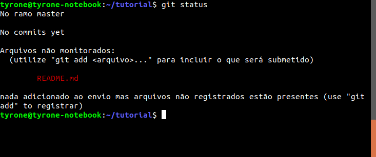

# Git Tutorial
Tutorial de primeiros passos com GIT e Github!

Olá! Eu sou Tyrone Damasceno, este rápido tutorial propõe explicar o que é e como se usa o a ferramenta de controle de versão GIT, e sua principal (*minha opinião*) plataforma, o Github.

A esta altura, espero que você já tenha visto a introdução de conceitos nos slides, mas caso contrário é só clicar [aqui](slides/slides.pdf)!

## Vamos lá, mão na massa!

Aqui nós vamos usar um ambiente Unix like, porém o GIT também funciona em outras plataformas.

Se seu computador é Ubuntu, ou algum de seus derivados, abra um terminal com o comando:
`CTRL + ALT + T`

Agora com um terminal aberto, crie uma nova pasta e navegue para dentro dela com os comandos:

```
$ mkdir tutorial
$ cd tutorial
```

Certo, agora você já criou uma pasta/diretório, precisamos transformar ela num repositório git, como fazer isso?

`$ git init`

Para conferir o que foi criado , digite o comando:

`ls -a`


Depois de criar o repositório git, é preciso configurar seu usuário e senha localmente. Fazemos isso com os comandos:

```
$ git config --global user.name "Tyrone Damasceno"
$ git config --global user.email "tyronedamasceno@gmail.com"
```


## Muito bem! Você acabou de inicializar seu primeiro repositório GIT!

Mas, e agora? O que fazer?

Como nós já sabemos, o git é um sistema de controle de versão, ou seja, ele monitora os seus arquivos e cria um histórico das alterações sem ser necessário criar os clássicos arquivos com `v1, v2, v2_final, v2_final_final, v3_agora_vai`, etc!

Então pra isso, vamos criar um arquivo na nossa pasta, para que ele possa ser controlado (aqui eu usarei Python e Markdown como exemplo, mas isso serve pra **QUALQUER TIPO DE ARQUIVO DE TEXTO**).

*Ok, eu sei que dá pra colocar arquivos binários (que não são texto, como imagens, pdf, executáveis, etc), mas não é o ideal, por que nós (humanos) geralmente não conseguimos distinguir alterações em bits, além de deixar o seu repositório "pesado"*

Voltando... Uma boa prática é criar um arquivo chamado `README.md` na raiz do seu repositório (tipo esse que você tá lendo), contendo informações importantes sobre o que vai ser criado, configurações e instruções de uso, etc.

Então, vamos criar! Aqui eu usarei o Visual Studio Code para editar meus arquivos, mas sinta-se a vontade para trabalhar com o editor de texto que você preferir! Para abrir o VS Code já no seu repositório, basta navegar no terminal até a raiz do projeto e digitar o comando:
`$ code .`
O argumento . significa "a pasta atual".

No README eu escreverei uma breve descrição do repositório utilizando linguagem markdown!


## Eita, eu já estou versionando?

Calma, falta muito pouco, nós criamos o arquivo, agora vamos dizer ao GIT pra ficar tomando conta dele.

Primeiro, vamos ver o comando de git MAIS USADO de todos! Digite no seu terminal:

`$ git status`

Você deve ver algo assim:



Olha o que ele está te dizendo: O arquivo `README.md` não está monitorado. Antes de fazer o nosso commit (calma, ainda vou explicar o que é), precisamos adicionar ele a uma chamada *staging area*, que pode ser visto como uma sala de espera do seu repositório. 
Imagina assim, o seu repositório tem todos os seus arquivos vivendo felizes, aí um novo arquivo chega (seja ele um arquivo ainda não monitorado ou um arquivo já monitorado com alterações), mas esse arquivo só pode entrar no seu repositório junto de alguns outros que você ainda está esperando chegar, então você deixa ele numa salinha de espera pra quando for a hora, todos entrarem juntos! 
Caso ele seja algum arquivo que já existia e só traz algumas mudanças, o git automaticamente vai guardar uma *foto* do arquivo antigo, e uma descrição do que mudou nele. Essas mudanças são armazenadas na pasta `.git`, lembra dela? Nós a vimos lá quando criamos o repositório e digitamos `ls -a`.

Após toda essa historinha (espero que tenha sido útil), vamos jogar o nosso arquivo na `staging area`, para isso, usamos o comando `add`, em seguida é interessante olhar novamente o status do repositório (eu disse que era o mais usado):

```
$ git add README.md
$ git status
```

Você deve encontrar algo assim:


Agora que nosso arquivo README já está na "sala de espera", e que ele não está esperando mais ninguém chegar, podemos mandar ele entrar no repositório. Essa operação de adicionar um arquivo (ou alterações) ao repositório se chama: **COMMIT**. 

Commits são a operação principal num repositório git, eles oficializam as mudanças de arquivos. Um commit "exige" uma mensagem, onde você informa de que se trata aquelas mudanças que você fez!

Vamos fazer o nosso commit, existem algumas formas, a que eu mais gosto é de digitar diretamente a mensagem na linha de comando.
Faremos o comando e novamente vamos ver o status do repositório.

`$ git commit -m "Adicionando um README ao repositório"`


## Well done!!!

Agora, acabamos de fazer o nosso primeiro commit, ou seja, já dissemos ao nosso repositório GIT pra ele registrar o arquivo que acabamos de adicionar e ficar de olho caso haja alguma mudança. 

Porém, essas mudanças estão apenas localmente no nosso computador, que tal deixar isso aberto para todos, além de ter nosso código armazenado na nuvem? Já sabe o que fazer? Isso mesmo!!! Vamos colocar nosso repositório no **github**!

Acesse www.github.com e faça seu login (caso você ainda não possua uma conta no github, esta é a hora de criar)

No canto esquerdo superior, há um botão verde escrito *New*, clique nele para criar um novo repositório!


Em seguida, escolha um nome para o repositório, uma descrição (opcional), selecione público, afinal queremos que todos vejam os incríveis códigos que nós fazemos e possam até nos ajudar a deixá-los mais incríveis ainda! Por fim, clique em ****


*Ps: Por enquanto, não precisamos selecionar para inicializar um README, licensa ou gitignore*

Agora, provavelmente você encontrou uma página com algumas instruções, vamos usar a segunda delas, *…or push an existing repository from the command line*.

Então, no nosso terminal digite os comando que o github já te sugere e veja o que acontece (tem um botão que já copia os comandos)!


